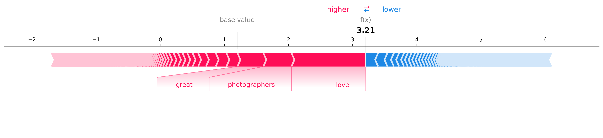

# Amazon Electronics Sentiment Analysis with Explainable AI
Welcome to the **Amazon Electronics Sentiment Analysis** project! This repository demonstrates a comprehensive approach to sentiment analysis of product reviews from the Amazon Electronics dataset, integrating traditional machine learning and Explainable AI (XAI) techniques to provide deep insights into model behavior. Designed for scalability and interpretability, this project showcases industry-relevant practices that align with the expectations of top-tier tech companies.
---
## 🚀 Project Overview
The goal of this project is to classify Amazon reviews as **positive** or **negative**, leveraging:
- **Machine Learning Models**: Logistic Regression.
- **Explainable AI**: SHAP (SHapley Additive exPlanations) to interpret the model's decisions.
- **Efficient Preprocessing**: Using TF-IDF to vectorize text.

*Figure: SHAP global feature importance highlighting the most influential words.*
---
## 🛠️ Features
### 1. **Logistic Regression**
A lightweight and efficient baseline model achieving competitive accuracy, with:
- Balanced class weights for improved performance on imbalanced data.
- TF-IDF for feature extraction.
### 2. **Explainable AI (XAI)**
Integration of SHAP to:
- Analyze the global importance of words influencing predictions.
- Explain individual predictions through visualizations.
---
## 📂 Repository Structure
```
.
├── data/
│   ├── raw/                     # raw dataset files
│   ├── processed/               # preprocessed datasets
├── models/
│   ├── sentiment_model.pkl      # logistic regression model
│   ├── tfidf_vectorizer.pkl     # vectorizer
├── src/
│   ├── preprocess.py            # preprocessing script
│   ├── train_model.py           # logistic regression training
│   ├── explain_model.py         # xai explanation generation
├── plots/
│   ├── feature_importance.png   # shap summary plot
│   ├── local_explanation_0.png  # sample shap explanation
├── README.md                    # project overview
```
---
## 🔧 Setup and Installation
### Prerequisites
- Python 3.7+
- Virtual environment (recommended)
### Installation
1. Clone the repository:
   ```bash
   git clone https://github.com/your-username/Amazon-Electronics-Sentiment-XAI.git
   cd Amazon-Electronics-Sentiment-XAI
   ```
2. Set up a virtual environment:
   ```bash
   python -m venv venv
   source venv/bin/activate  # on Windows: venv\Scripts\activate
   ```
3. Install the required dependencies:
   ```bash
   pip install -r requirements.txt
   ```
4. Download the dataset and place it in `data/raw/`.
---
## 📊 Results
### Logistic Regression:
- **Accuracy**: 84.77%
- **F1-Score** (Positive Class): 90%

*Figure: SHAP local explanation for a sample review.*
### SHAP Visualizations:
- Global Feature Importance: Shows the top influential words.
- Local Explanations: Explains specific predictions.
---
## 🚩 Next Steps
- Expand the use of Explainable AI for deeper insights.
- Experiment with advanced NLP techniques (e.g., BERT).
---
## 🤝 Contributing
Contributions are welcome! Please open an issue or submit a pull request.
---
## 📜 License
This project is licensed under the MIT License. See the LICENSE file for details.
---
## 👩‍💻 Author
Francesco Gabrieli  
25 y/o Information Engineering graduate passionate about AI, data analytics, and software engineering.
---
Ready to dive in? Let’s uncover the sentiments behind Amazon reviews together!