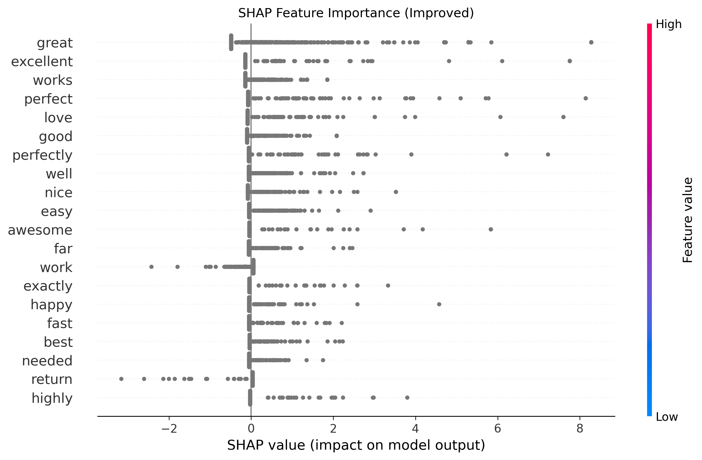

# Amazon Electronics Sentiment Analysis with Explainable AI

Welcome to the Amazon Electronics Sentiment Analysis project! This repository showcases a sophisticated approach to analyzing product reviews from the Amazon Electronics dataset. Combining machine learning and Explainable AI (XAI) techniques, the project delivers actionable insights into model predictions while adhering to industry best practices.


---
## 🚀 Project Overview
The primary objective of this project is to classify Amazon product reviews as positive or negative while providing interpretability through Explainable AI methods. Key components include:
- **Machine Learning Models**: Logistic Regression for baseline performance.
- **Explainable AI**: SHAP (SHapley Additive exPlanations) for model interpretability.
- **Efficient Preprocessing**: Leveraging TF-IDF vectorization for textual feature extraction.

*Figure: SHAP global feature importance highlighting the most influential words.*
---
## 🛠️ Features
### 1. **Logistic Regression**
A robust baseline model that demonstrates:
- Competitive accuracy with balanced class weights to address data imbalance.
- Utilization of TF-IDF for effective textual representation.
### 2. **Explainable AI (XAI)**
Integration of SHAP to:
- Visualize global feature importance, identifying the key drivers of predictions.
- Provide local explanations, enabling a deeper understanding of individual predictions.
---
## 📂 Repository Structure
```
.
├── data/
│   ├── raw/                     # raw dataset files
│   ├── processed/               # preprocessed datasets
├── models/
│   ├── sentiment_model.pkl      # logistic regression model
│   ├── tfidf_vectorizer.pkl     # vectorizer
├── src/
│   ├── preprocess.py            # preprocessing script
│   ├── train_model.py           # logistic regression training
│   ├── explain_model.py         # xai explanation generation
├── plots/
│   ├── feature_importance.png   # shap summary plot
│   ├── local_explanation_0.png  # sample shap explanation
├── README.md                    # project overview
```
---
## 🔧 Setup and Installation
### Prerequisites
- Python 3.7+
- Virtual environment (recommended)
### Installation
1. Clone the repository:
   ```bash
   git clone https://github.com/your-username/Amazon-Electronics-Sentiment-XAI.git
   cd amazon-electronics-sentiment-xai
   ```
2. Set up a virtual environment:
   ```bash
   python -m venv venv
   source venv/bin/activate  # on Windows: venv\Scripts\activate
   ```
3. Install the required dependencies:
   ```bash
   pip install -r requirements.txt
   ```
4. Download the dataset and place it in `data/raw/`.
---
## 📊 Results
### Logistic Regression:
- **Accuracy**: 84.77%
- **F1-Score** (Positive Class): 90%

*Figure: SHAP local explanation for a sample review.*
### SHAP Visualizations:
- Global Feature Importance: Highlights the most influential words contributing to predictions.
- Local Explanations: Provides interpretability for individual reviews.
---
## 🚩 Next Steps
- Expand the use of Explainable AI for enhanced interpretability.
- Experiment with advanced natural language processing models, such as BERT or GPT.
- Explore additional feature engineering techniques to further improve model performance.
---
## 🤝 Contributing
Contributions are welcome! Feel free to open an issue or submit a pull request for improvements or feature suggestions.

---
Ready to dive in? Let’s uncover the sentiments behind Amazon reviews together!
